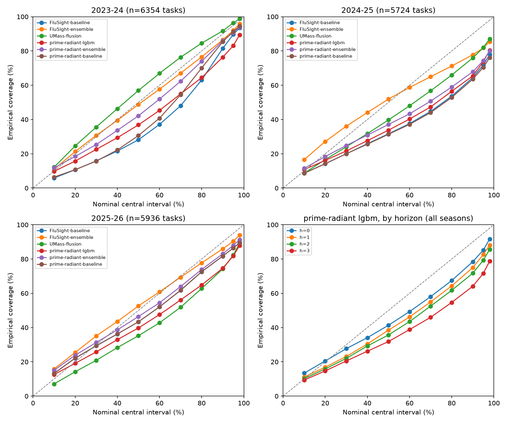

# Prime Radiant

Calibrated forecasting, measured honestly. Two threads share this repo:

- **FluSight epi forecaster** (`prime_radiant.epi`) — CDC FluSight-format quantile
  forecasts of weekly US influenza hospital admissions: LightGBM quantile regression
  in the shape of the FluSight-2023/24-winning flusion model, ensembled with a
  validated replica of CDC's own baseline. Pure statistical pipeline; no LLM calls.
- **Metaculus bot** (`prime_radiant.metaculus`) — LLM forecasting on binary
  questions (parked at its retrieval phase; client + tests remain green).

## Backtest results (three seasons, vintage-honest)

Rolling-origin backtests over 85 weekly origins across the 2023-24, 2024-25 and
2025-26 seasons. Every forecast is trained only on the data snapshot a live
forecaster would have held on the Wednesday submission evening (the hub's git
history is the vintage store); scored against final truth as of 2026-07-09,
horizons 0-3, all 53 jurisdictions. `wis_rel` = mean WIS relative to the official
FluSight-baseline on the common task set across all six models (lower is better;
the official "scaled relative skill" collapses to this ratio on identical sets).
Coverage columns are computed on each model's full scored set; relative-skill
columns on the common set — `n` and `n_relative` in the CSVs disclose both.

**2025-26** — our model leads the table on the natural scale (on the log(x+1)
scale UMass-flusion edges it, 0.583 vs 0.585 — both columns are in the CSVs):

| model | wis_rel | 50% cov | 95% cov |
|---|---|---|---|
| **prime-radiant-lgbm** | **0.609** | 0.398 | 0.818 |
| UMass-flusion | 0.625 | 0.353 | 0.823 |
| FluSight-ensemble | 0.666 | 0.526 | 0.903 |
| prime-radiant-ensemble | 0.764 | 0.464 | 0.880 |
| FluSight-baseline | 1.000 | 0.433 | 0.864 |

**2024-25** — the multi-model ensembles beat us; we beat the baseline:

| model | wis_rel | 50% cov | 95% cov |
|---|---|---|---|
| UMass-flusion | 0.669 | 0.397 | 0.820 |
| FluSight-ensemble | 0.675 | 0.519 | 0.818 |
| **prime-radiant-lgbm** | **0.796** | 0.338 | 0.738 |
| prime-radiant-ensemble | 0.900 | 0.371 | 0.744 |
| FluSight-baseline | 1.000 | 0.317 | 0.719 |

**2023-24** — flusion dominates; our ensemble edges FluSight-ensemble:

| model | wis_rel | 50% cov | 95% cov |
|---|---|---|---|
| UMass-flusion | 0.569 | 0.569 | 0.964 |
| **prime-radiant-ensemble** | **0.716** | 0.422 | 0.909 |
| FluSight-ensemble | 0.730 | 0.488 | 0.920 |
| prime-radiant-lgbm | 0.841 | 0.369 | 0.831 |
| FluSight-baseline | 1.000 | 0.282 | 0.897 |

Full tables (per-horizon rows, log-scale variants, AE-median, task counts):
[`reports/backtest_<season>.csv`](reports/). Calibration:



## Honest framing

- **The backtest is net biased against us, and we keep it that way.** Adversarial
  verification proved that on three 2024-25 holiday weeks the official baseline's
  run saw data committed Thursday+, which our live-Wednesday vintage discipline
  refuses; on the 24 information-equal origins our relative WIS improves (lgbm
  ~0.73). It is not one-way: at three October-2023 origins our vintages were
  fresher than what the official run used. One 2023-24 origin (2024-04-13) had a
  week-stale vintage — for our models only; the officials ran on fresh data there.
- **Our intervals are too narrow.** The lgbm's 50% intervals cover 34-40% and its
  95% intervals 74-83% — under-dispersed, visible in the calibration curves.
  FluSight-ensemble is better calibrated even where we beat it on WIS. This is
  the main modeling debt; season-level bagging (flusion's stabilizer) is the
  known lever.
- **Wins and losses both stand.** We lead 2025-26 outright; UMass-flusion beats
  us clearly in 2023-24 and 2024-25. The 2023-24 lgbm ran on ~1.2 seasons of
  training history.
- **The scorer and baseline replica are self-validating — for the season they
  were validated on.** The replica reproduces the official 2024-25 baseline to
  relative WIS 0.99999 on fingerprint-matched vintages (Phase B). In 2023-24 the
  replica scores 0.976 vs the official baseline — a spread-construction
  divergence at matched anchors that Phase B's validation (2024-25-era official
  code) does not cover; adversarially checked: substituting the actual official
  baseline into our ensemble changes no table ordering.

## Methodology in one paragraph

NHSN weekly admissions (hub target data, git-vintaged) → per-100k 4th-root
transform with per-location scale/center fitted per origin → pooled LightGBM
quantile regression (23 levels, horizon-as-feature, deterministic, exact-pinned
4.7.0) → monotone sort, inversion, integer rounding at the hub boundary →
per-quantile-median ensemble with the baseline replica → WIS/coverage scoring on
natural and log(x+1) scales, pinned-truth, common-task relative skill. Every
stage boundary carries a pandera contract; leakage invariants (vintage as-of,
feature cut, scaler fit) are hypothesis-tested properties.

## Setup

```sh
uv sync --all-groups
make check            # offline gates: ruff + format + pyright + pytest-cov
make test-integration # network: real hub clone, S3 benchmarks, gate + reports
```

Requires Homebrew `libomp` on macOS for LightGBM. Built with [Claude Code]
(agentic coding assistant by Anthropic); every phase was adversarially verified
by refuter agents before being declared done — see `NOTES/restart.md` and the
`[claude]`-prefixed commit history.

## Dashboard

A Gradio dashboard (US choropleth of predicted 3-week change, per-state fan
charts, reliability curves, model-vs-baseline league tables) serves the frozen
backtest record from `serve_data/`, a ~1.7MB precomputed bundle:

```sh
make bundle                        # offline: rebuilds serve_data/ deterministically
uv run python dashboard/app.py     # local: http://127.0.0.1:7860
```

The Space (`jeremygracey-ai/prime-radiant`, CPU-basic) installs only
gradio/plotly/pandas/pyarrow — never this package, so no LightGBM/libomp and no
hub clone at serve time. `.github/workflows/space-deploy.yml` stages and
validates the Space tree on every dispatch; the actual push is triple-gated
(manual `deploy=true` + `SPACE_LIVE=1` repo var + `HF_TOKEN` secret) and stays
inert until go-live.

## Limitations

- Single data source (NHSN), single target (`wk inc flu hosp`); no rate-change /
  peak / ED-visit targets yet.
- Interval under-dispersion as above; no season-bagging yet.
- 2022-23 is not backtestable (the hub's vintage history begins Oct 2023).
- Live submission machinery exists (Phase E) but is structurally inert: the
  weekly workflow's live path is triple-gated and unimplemented past its gates,
  and nothing submits anywhere without the go-live runbook being executed by
  hand. The dashboard serves a frozen bundle, not a live feed.
