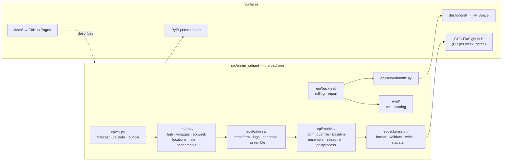
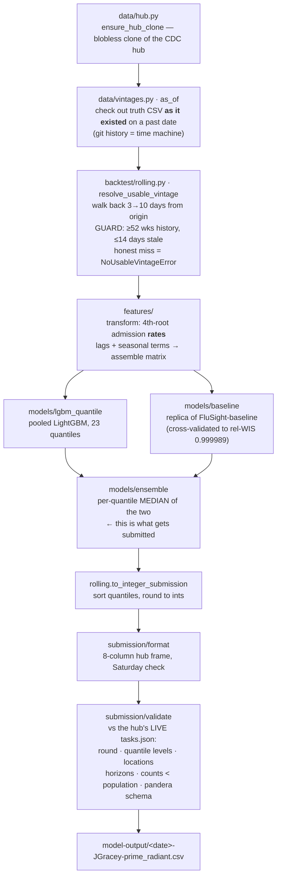
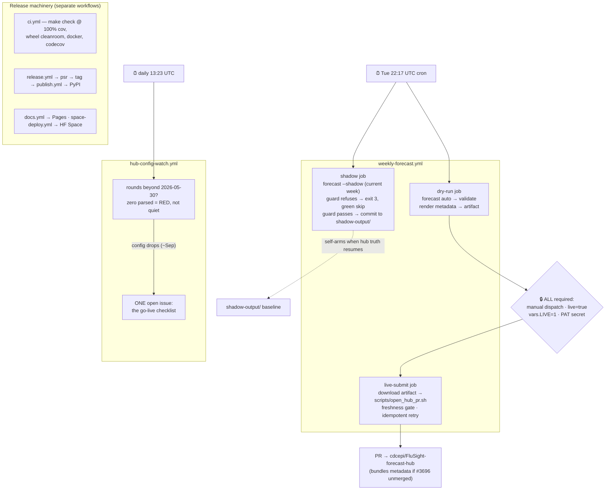

# Codebase walkthrough

Three passes over the repository: the **map** (where things live), the
**forecast pipeline** (what a run actually computes), and the **automation**
(how it runs itself, and where the gates are). A designed rendition of this
page ships as [a PDF](prime-radiant-codebase.pdf).

## 1. The map — where everything lives

Everything interesting is one Python package plus four surfaces that consume it.

Reading order for a newcomer: `src/prime_radiant/epi/cli.py` is the front
door — three subcommands, everything else hangs off them. `epi/data` gets and
time-scopes the data, `features`/`models` do the ML, `submission` speaks the
hub's contract, `backtest` + `eval` prove the model is honest, `serve`
packages results for the dashboard. `metaculus.py` and `replication.py` are
the parked Phase-1 thread. At the top level, `tests/` mirrors all of it at
100% coverage, `scripts/open_hub_pr.sh` is the one shell dependency, and
`NOTES/` is the project's memory.

## 2. The heart — what one weekly forecast run computes

The load-bearing idea is **vintage discipline**: never let the model see data
dated after the forecast origin. That is why the data layer is built on git
archaeology rather than "download latest".

The same `run_origin` function drives both live forecasts and the historical
backtests — `backtest/rolling.py` replays it across 55 past origins,
`eval/wis.py` scores each with the hub's own metric (weighted interval score),
`backtest/report.py` writes the league tables, and `serve/bundle.py` snapshots
all of it into the offline bundle the dashboard serves. One code path, so a
backtest win means something about the live path.

## 3. The nervous system — how it runs itself, and where the gates are

The design rule tying it together: **every gate is structure, not prose**.
Cron cannot reach `live-submit` (its `if:` requires a dispatch event), the
shadow validator relaxes exactly one check and the live path cannot invoke
that relaxation, the PR script refuses stale reference dates with its own
exit code — and each of those claims has a test that a mutant provably fails
(`tests/unit/test_workflow_honesty.py` and friends). The forecast can be
wrong; the plumbing can't quietly lie about what it did.

## 4. The next step — the season starts itself

| When | What fires | Whose action |
| --- | --- | --- |
| Now | Shadow job green-skips weekly; watcher checks the hub config daily | none |
| ~Sep (precedent: Sep 5–30) | 2026-27 config lands → watcher opens its issue; hub truth resumes → shadow CSVs start landing in `shadow-output/` | none |
| The gap | PAT + `LIVE=1` set; dry-run dispatched against a real new-season round | operator |
| First open window (possibly mid-Oct) | First real submission — explicit go only | operator |
| ~Nov 18 | Guaranteed open: mass season start | operator |
